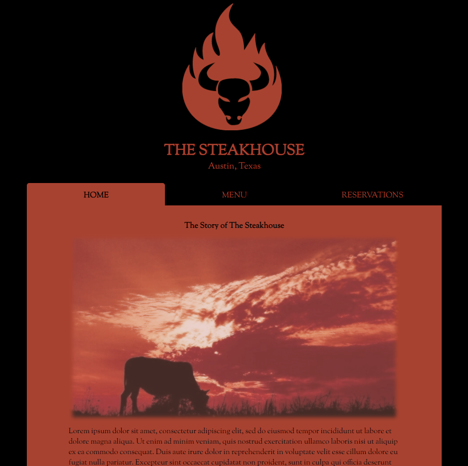
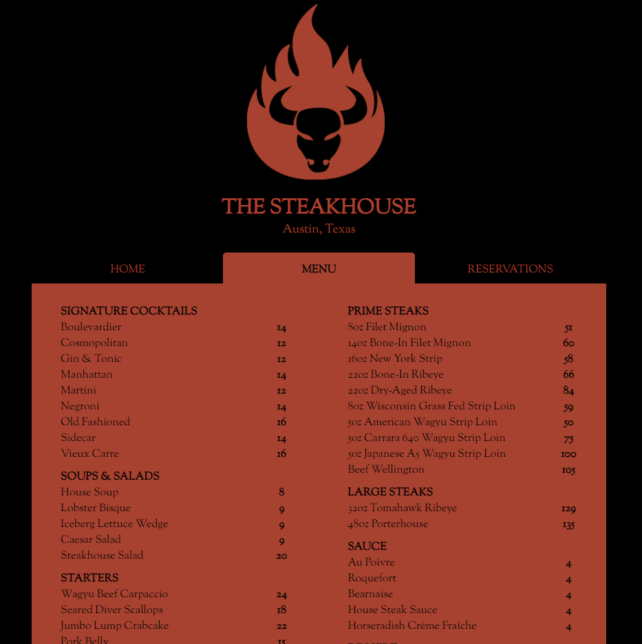
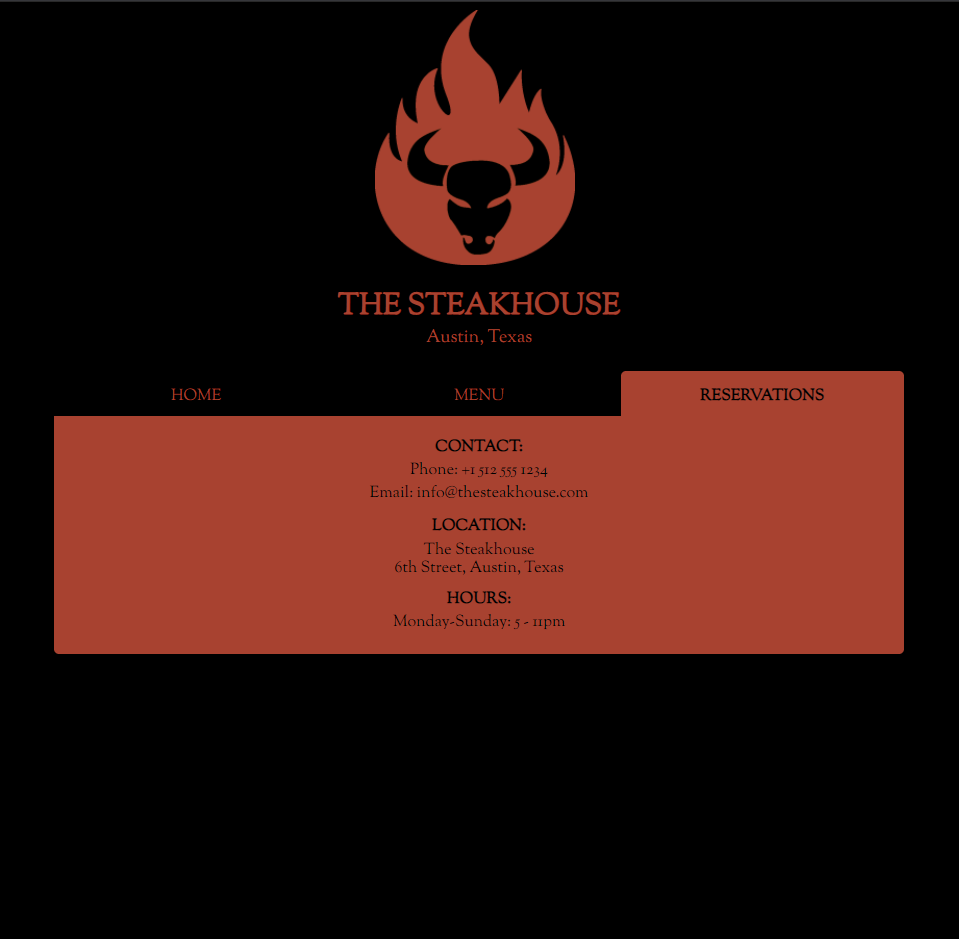

## Restuarant Page
Interactive Resturant Website

🔗 **Live preview** of the app is [here](https://j-haze.github.io//restaurant-page/).

### Purpose: ###
The purpose of this project was to create an interactive Restaurant website. The webpage features a ficticious restaurant, but serves as a sample of a site that could be made for a real restaurant. 

### Features: ###

* **Home Tab:** Features a story regarding the history and background of the restaurant.
* **Menu Tab:** Features all menu items currently being served.
* **Reservations Tab:** Features the restaurant's contact information.

### Built With: ###

* HTML/CSS
* JavaScript
* Webpack

### Pictures: ###

